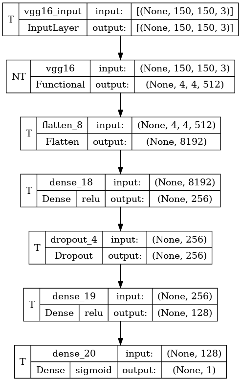

# cat-dog-cnn-classifier
In this project, I have use concept of data augmentation and transfer learning pretrained VGG model (Convolution Neural Network) for creating a model to classify between dog and cat.
 
 Image of the CNN architecture used:
  

